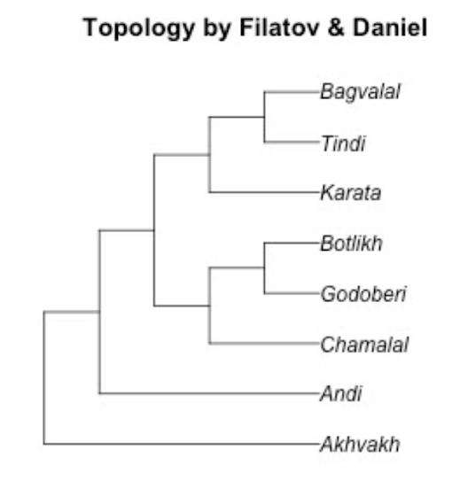

```{r setup, include=FALSE}
# setwd("/home/agricolamz/work/materials/2021.06.15_conlab_andic_dicts")
knitr::opts_chunk$set(echo = FALSE, warning = FALSE, message = FALSE, dev='cairo_pdf')
options(tinytex.verbose = TRUE)
library(tidyverse)
theme_set(theme_bw())
andic_dicts <- read_csv("data/andic_dicts.csv")

andic_dicts %>% 
  distinct(glottocode) %>% 
  mutate(language = lingtypology::lang.gltc(glottocode)) ->
  andic_langs_glottocodes
  
# create qrcode
# library(qrcode)
# png(filename="images/00_qrcode.png", width = 150, height = 150)
# qrcode_gen("https://github.com/agricolamz/2021.06.15_conlab_andic_dicts/raw/master/2021.06.15_conlab_andic_dicts.pdf")
# dev.off()
```

#  About the database

## About the database: participants

On May 23 we released a first version of Comparative Andic dictionary database --- collection of digitized dictionaries of Andic languages.

<https://github.com/phon-dicts-project/comparative_andic_dictionary_database> \pause

We worked during the last two years combining the database creation with term paper and other projects:

* Arseniy Averin (2 years)
* Anastasia Davidenko (2 years)
* Zlata Shkutko (2 years)
* Grigory Kuznetsov (2 years)
* Ilya Sadakov (1 year)
* Anna Tsysova (1 year)
* Wanshu Zhang (1 year)
* Samira Verhees (1 year)
* Chiara Naccarato (1 year)

## About the database: contents

Number of lemmata per dictionary:

```{r}
andic_dicts %>% 
  distinct(glottocode, reference, lemma) %>% 
  count(glottocode, reference) %>% 
  left_join(andic_langs_glottocodes) %>% 
  rename(lemmata = n) %>% 
  select(language, glottocode, reference, lemmata)
```

## About the database: contents

Number of meanings per dictionary\footnote[frame]{Except Chamalal and Botlikh: those dictionaries have not been split yet.}:

```{r}
andic_dicts %>% 
  count(glottocode, reference) %>% 
  left_join(andic_langs_glottocodes) %>% 
  rename(meaning = n) %>% 
  select(language, glottocode, reference, meaning)
```

## About the database: contents

* `id_word`: 9
* `id_meaning`: 1
* `id`: 11
* `lemma`: а'ва
* `ipa`: 'a-w-a
* `morphology`: (-лъ̄илIи / -лIи, /ди)
* `bor`: _
* `pos`: noun
* `meaning_ru`: дом
* `definition`: 1) дом, здание; *ава гурулъIа* строить дом 2) этаж; *кьIас̄е ава* верхний этаж; *гекьис̄е ава* нижний этаж; _цег._, _тлян._ *авал*, _ратл._ *авали*
* `glottocode`: akhv1239
* `reference`: Magomedova, Abdulayeva 2007

## About the database: contents

* `id_word`: 9
* `id_meaning`: 2
* `id`: 12
* `lemma`: а'ва
* `ipa`: 'a-w-a
* `morphology`: (-лъ̄илIи / -лIи, /ди)
* `bor`: _
* `pos`: noun
* `meaning_ru`: этаж
* `definition`: 1) дом, здание; *ава гурулъIа* строить дом 2) этаж; *кьIас̄е ава* верхний этаж; *гекьис̄е ава* нижний этаж; _цег._, _тлян._ *авал*, _ратл._ *авали*
* `glottocode`: akhv1239
* `reference`: Magomedova, Abdulayeva 2007

## About the database: contents

* `id_word`: 17
* `id_meaning`: 1
* `id`: 21
* `lemma`: ава'рийа
* `ipa`: a-w-'a-r-i-j-a
* `morphology`: (-лIи, -ди)
* `bor`: 1
* `pos`: noun
* `meaning_ru`: авария
* `definition`: авария (_дорожное происшествие_); *аварийа-лъ̄ига бухьурулъIа* попасть в аварию
* `glottocode`: akhv1239
* `reference`: Magomedova, Abdulayeva 2007

## About the database: purpose

What can be done with this database?

* calculate frequency of phonological units and compare them across Andic languages
* use some modern tools like Edictor [@list2017d] for automatic analysis of sound correspondences
* annotate concepts from Concepticon [@concepticon21] with `pyconcepticon` and use some tools for investigation of the colexification (see the CLICS project [@rzymski20])
* the database also could be a good ground for selecting words for a phonetic or any other research

# Phonological distances between languages

## Phonological distances

In order to calculate phonological distances I used the following algorithm:

* remove borrowings and Tokita data;
* remove the stress sign;
* remove duplicated IPA transcriptions for each language;
* extract frequencies of each segments and use in hierarchical clusterization

## Phonological distances: results  

```{r, fig.height=5, fig.width=9}
library(tidytext)
andic_dicts %>% 
  filter(is.na(bor), 
         glottocode != "toki1238") %>% 
  distinct(glottocode, reference, ipa) %>% 
  mutate(stress_count = str_count(ipa, "(?<=(-)|(^))'")) %>% 
  filter(stress_count < 2) %>% 
  mutate(ipa = str_remove(ipa, "(?<=(-)|(^))'")) %>% 
  distinct(glottocode, reference, ipa) %>% 
  left_join(andic_langs_glottocodes) %>%
  unnest_tokens(input = ipa, output = "segment",  token = str_split, pattern = "-") %>% 
  count(language, reference, segment) %>% 
  mutate(ratio = n/sum(n),
         new_lang = str_c(language, "\n(", reference, ")")) %>% 
  select(new_lang, segment, ratio) ->
  ratios
  
ratios %>% 
  mutate(segment = as.integer(as.factor(segment))) %>% 
  pivot_wider(names_from = segment, values_from = ratio, values_fill = 0) %>% 
  as.data.frame->
  for_clust

rownames(for_clust) <- for_clust$new_lang
library(ggdendro)
for_clust %>%
  select(-new_lang) %>% 
  dist(method = "manhattan") %>% 
  hclust() %>% 
  as.dendrogram() %>% 
  dendro_data(type = "rectangle") ->
  dd

ggplot(segment(dd)) + 
  geom_segment(aes(x = x, y = y, xend = xend, yend = yend)) + 
  coord_flip() + 
  scale_y_reverse(expand = c(0.2, 0))+
  geom_text(data = label(dd), 
              aes(x = x, y = y, label = label), size = 4)+
  theme_void()
```

## Phonological distances: phylogenetic data



Obtained phonological distances does not correlate with phylogenetic distances.

## Can dictionary data be trusted?

* There are some morphemes that could increase freaquency of certain segments
* However, in [@davidenko21] we compared dictionary and corpora frequencies of Andi, Botlikh and Bagvalal phonological segments and found a linear relation between them:

$$\text{corpora frequency} = 0.002 + 0.906 \times \text{dictionary frequency}$$

## {}

\LARGE Thank you for your attention!

# References {.allowframebreaks}
